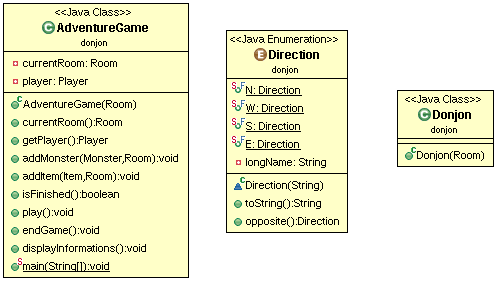
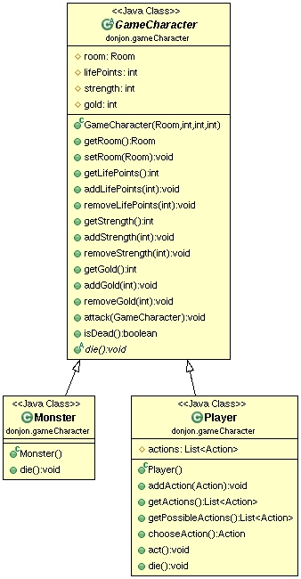
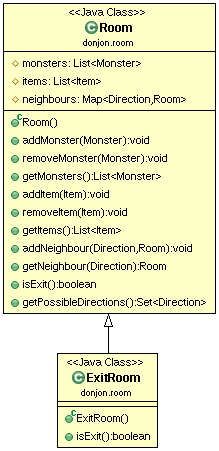
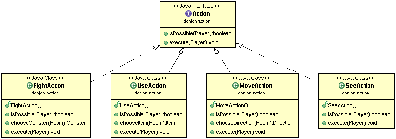
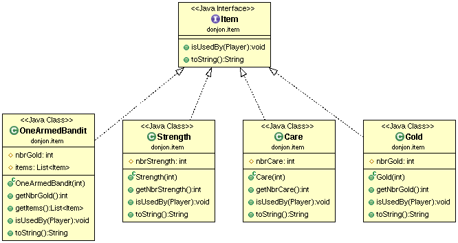
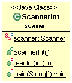

# DONJON
## TEXIER Léane

## Introduction sur le sujet du projet
Mettre en place un jeu de donjon.
Le donjon comporte différentes salles reliées et pouvant comporter des monstres et des items.
Le joueur se déplace de salle en salle jusqu'à ce qu'il perde ou qu'il arrive à une salle finale.   

## Howto
#### Récupération du dépot   
git pull   
    
Aller dans le dossier COO-DONJON   

#### Génération de la documentation   
Dans le dossier COO-DONJON:   
mvn javadoc:javadoc    
Pour consulter la doc: aller dans target/docs   
Puis lancer index.html pour consulter les différentes docs  

#### Génération du projet et tests  
Dans le dossier COO-DONJON:   
mvn package  

#### Execution de l'archive générée  
Dans le dossier COO-DONJON:   
java -jar target/COO-DONJON-1.0-SNAPSHOT.jar   

## Elements de code saillant
Création de plusieurs classes abstraites de tests appelées dans d'autres classes de tests (ex: gameCharacterTest).   

## Commentaires concernant le projet
Par manque de temps, je n'ai pas eu le temps de mettre en place une génération aléatoire de donjon.
Le donjon de test contient 3 salles avec différents monstres et items dans les pièces.  
  
## Diagrammes UML
##### Package donjon

##### Package gameCharacter

##### Package room

##### Package action

##### Package item

##### Package scanner

