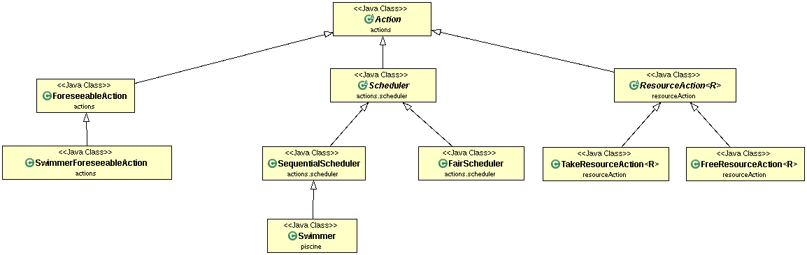

# DONJON
## TEXIER Léane

## Introduction sur le sujet du projet
Le projet consiste tout d'abord à mettre en place différentes actions.
Les actions peuvent avoir :        
* un temps défini à l'avance (ForeseeableAction)       
* un certains nombre d'actions (Scheduler) à faire les unes après les autres (SequentialScheduler) ou en parallèle (FairScheduler).        

La seconde partie du projet consiste à résoudre le problème de la piscine (problème des paniers et des cabines). Nous devons donc pour cela mettre en place des gestionnaires de ressources (resourcePool) dépendant de ressources (Resource) que nous devons également créer. Il faut aussi mettre en place des actions pour prendre et rendre des ressources aux gestionnaires de resources ainsi que des utilisateurs de ces ressources (ResourceUser). Il faut ensuite créer des swimmers et une simulation peut alors être faite (Ex: SwimmingPool).          

## Howto
#### Récupération du dépot   
git pull   
Aller dans le dossier COO-PISCINE   

#### Génération de la documentation   
Dans le dossier COO-PISCINE:   
mvn javadoc:javadoc    
Pour consulter la doc: aller dans target/docs   
Puis lancer index.html pour consulter les différentes docs  

#### Génération du projet et tests  
Dans le dossier COO-PISCINE:   
mvn package  

#### Execution de l'archive générée  
Dans le dossier COO-PISCINE:   
java -jar target/COO-PISCINE-1.0-SNAPSHOT.jar   

## Elements de code saillant
* Mise en place de Mock nottament dans la classe de test de ResourceAction pour les Resources et les ResourcePool.   
* Mise en place du principe ouvert-fermé.       
* Mise en place de la méthode agile.         
* Mise en place de classes génériques, de classes abstraites et d'interfaces.
* Mise en place de classes de tests abstraites pour éviter des duplicatas de tests.

## Diagrammes UML
##### Diagramme simplifié concernant Action et ses héritages
        

##### Package actions
     

##### Package piscine
     

##### Package resource
    

##### Package resourceAction
       

##### Package resourcePool
     

##### Package resourceUser

