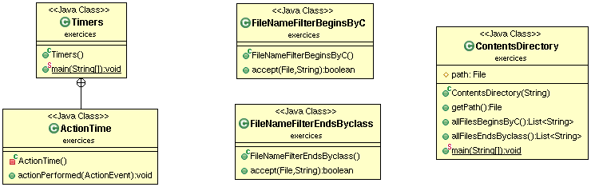
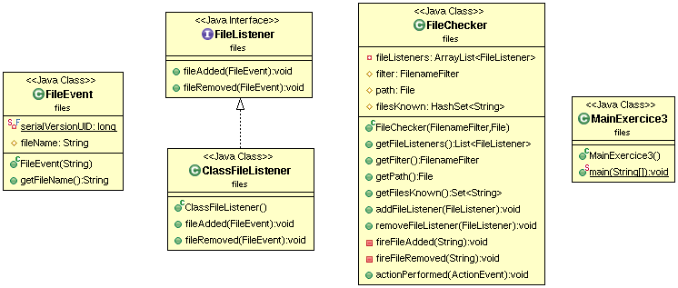
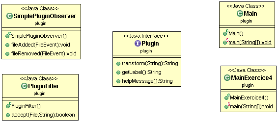
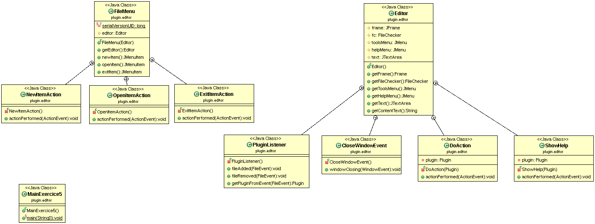
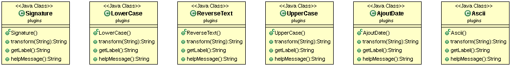

# PLUGINS
## TEXIER Léane

## Introduction sur le sujet du projet
Ce TP a pour but de créer une interface qui s'adapte dynamiquement en fonction des fichiers ajouté à un dossier (repository).   
Il a été nécessaire, tout d'abord, de faire des exercices intermédiaires afin de découvrir différentes fonctionnalités (timer, lister le contenu d'un dossier, filter).    
Le programme final ajoute (respectivement supprime) à une interface et le notifie sur le terminal le(s) plugin(s) ajouté(s)(respectivement supprimé(s)) dans le dossier repository. Concernant l'interface, l'ajout et la suppression de plugin se fait dans les menu "Tools" et "Help".     
Le menu "Help" permet d'avoir une information sur le plugin (celui cliqué).     
Le menu "Tools" permet de transformer le texte de l'éditeur suivant le plugin sélectionné.   
Le menu "File" permet d'ouvrir un fichier, de fermer l'interface et avec "New" de vider le texte de l'éditeur.   

## Information importantes
Dans le dossier available, vous trouverez différents plugins que j'ai implémenté et qui serviront pour ajouter/supprimer des plugins au dossier repository.    

## Howto
#### Récupération du dépot   
git pull   
Aller dans le dossier COO-PLUGINS   

#### Génération de la documentation   
Dans le dossier COO-PLUGINS :   
mvn javadoc:javadoc    
Pour consulter la doc: aller dans target/site/apidocs   
Puis lancer index.html pour consulter les différentes docs  

#### Génération du projet et tests
Dans le dossier COO-PLUGINS :   
mvn package  

#### Execution de l'archive générée (mode interface)    
Dans le dossier COO-PLUGINS :      
java -jar target/COO-PLUGINS-1.0-SNAPSHOT.jar         

#### Execution Exercice 1     
Dans le dossier COO-PLUGINS puis target puis classes :         
java exercices.Timers               

#### Execution Exercice 2  
Dans le dossier COO-PLUGINS puis target puis classes :                 
java exercices.ContentsDirectory exercices             

#### Execution Exercice 3   
Dans le dossier COO-PLUGINS :               
java -classpath target/classes:repository files.MainExercice3 repository                 
(Ne pas hésitez à ajouter et supprimer des fichiers dans repository (il y en a dans le dossier available) pour voir que l'ajout et la suppression se notifie pour des .class)           

#### Execution Exercice 4   
Dans le dossier COO-PLUGINS :                   
java -classpath target/classes:repository plugin.MainExercice4          
(Ne pas hésitez à ajouter et supprimer des fichiers dans repository (il y en a dans le dossier available) pour voir que l'ajout et la suppression se notifie pour des plugin(respect de certaines contraintes cf. le sujet du projet))                      

#### Execution Exercice 5   
Dans le dossier COO-PLUGINS :            
java -classpath target/classes:repository plugin.editor.MainExercice5        
(Ne pas hésitez à ajouter et supprimer des fichiers dans repository (il y en a dans le dossier available) pour voir que l'ajout et la suppression pour des plugin(respect de certaines contraintes cf. le sujet du projet) se répercute dans les menu "Tools" et "Help")      

## Elements de code saillant
* Mise en place de Mock pour les tests
* Mise en place du principe ouvert-fermé
* Mise en place du design pattern observer/observable
* Ajout facile d'un nouveau plugin

## Diagrammes UML    

##### Package exercices
  

##### Package files
     

##### Package plugin
     

##### Package plugin.editor
     

##### Package plugins (contient les différents plugins créés)
     
