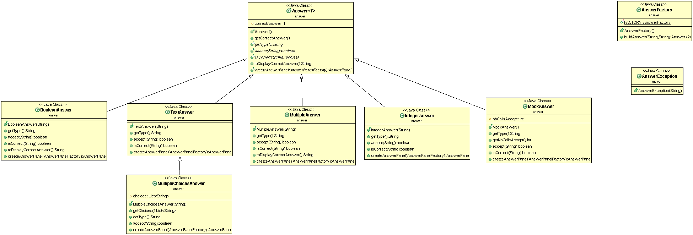
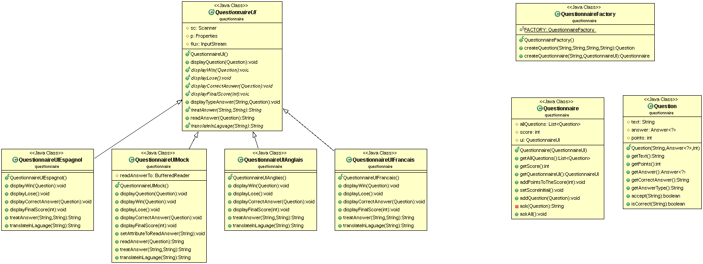
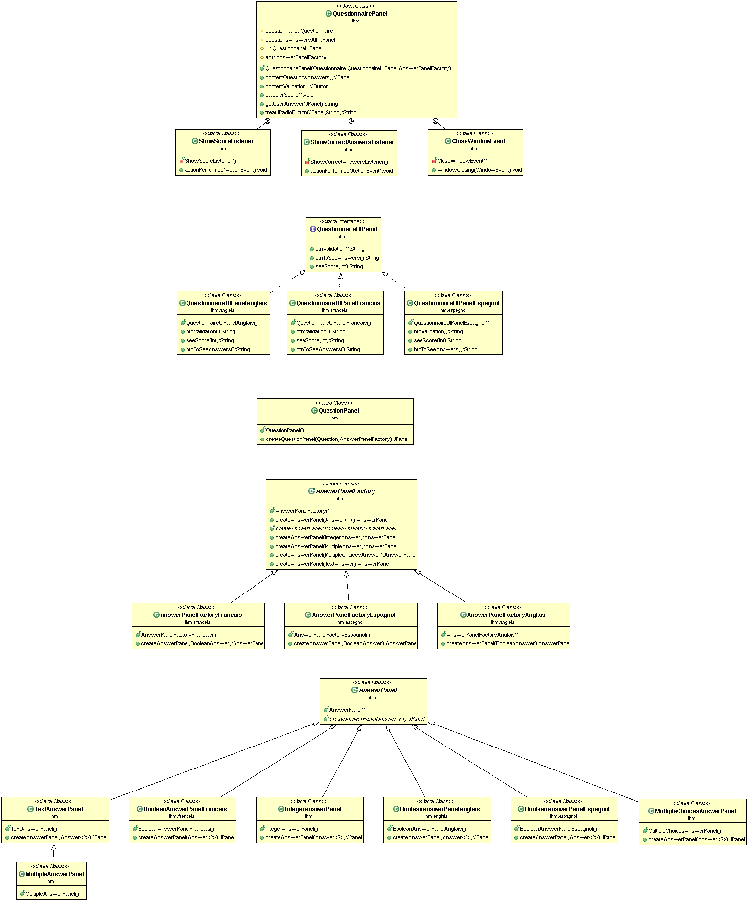

# QUESTIONNAIRE
## TEXIER Léane

## Introduction sur le sujet du projet
Le projet consiste tout d'abord à mettre en place un questionnaire en mode texte avec divers types de questions possibles. Plus précisément, avec des types de réponses différentes, qui sont les suivantes dans le projet:         
* Boolean answer (Réponse oui ou non)      
* Integer answer (Réponse est un entier)     
* Multiple answer (Réponse est multiple = pas une seule réponse bonne)   
* Multiple choices answer (Réponse est à choisir parmi des propositions)      
* Text answer (Réponse est un texte)   
    
Le questionnaire est défini grâce à un fichier texte. Celui-ci doit être composé pour chaque question d'une série de 4 lignes.   
* La première est la question.   
* La deuxième est la réponse à la question.   
* La troisième est le nombre de points que vaut la question.   
* La quatrième est le type de question(réponses) à choisir parmi les types possibles. Dans le cas présent, on a les types suivants disponibles: BooleanAnswer / IntegerAnswer / MultipleAnswer / MultipleChoicesAnswer / TextAnswer.   

Par la suite, nous devons mettre en place un questionnaire qui sera répondu via une interface graphique.  
Pour cela, nous avons du utiliser jswing.

Puis, en complément, nous pouvons "traduire" le questionnaire dans d'autres langues. L'ensemble sera traduit excepté le texte des questions et les réponses (sauf les questions booléennes).  
J'ai effectué, ces traductions pour le mode texte et pour l'interface. Les langues possibles sont: français, anglais et espagnol.
Les réponses aux questions booléennes attendant la traduction de "oui" et "non" dans la langue choisie pour le questionnaire, j'ai donc trouvé préférable que la bonne réponse à cette question soit également la traduction et ne reste pas en français.     

### Ajouter une langue au questionnaire
Pour ajouter une langue au questionnaire en mode texte (que cela devienne un choix possible lors du lancement du projet), il faut:
* Créer un fichier texte appelé nom_de_la_langue.txt qui associe à chaque clé correspondant au type de réponses (ici: NUMERICAL_KEY / SYMBOLIC_KEY / BOOLEAN_KEY / MULTIPLE_KEY / MULTIPLECHOICES_KEY) son type de question dans la langue choisie.  
* Créer un fichier QuestionnaireUI+nom_de_la_langue qui hérite de questionnaireUI et qui implémente les fonctions abstraites de sa classe parent sans oublier son constructeur qui initialise le flux grâce au fichier créé ci-dessus.
* Mettre à jour le main en ajoutant la possibilité de choisir cette langue.

Pour ajouter une langue au question en mode interface, il faut:
* Créer les 2 fichiers nécessaires pour le mode texte.
Dans un nouveau package appelé ihm.nom_de_la_langue:
* Créer un fichier AnswerPanelFactory+nom_de_la_langue qui hérite de la classe AnswerPanelFactory et qui implémente sa fonction abstraite.
* Créer un fichier BooleanAnswerPanel+nom_de_la_langue qui hérite de AnswerPanel et qui met en place sa fonction abstraite afin de pouvoir créer un JPanel approprié pour les questions de types booléennes.
* Créer un fichier QuestionnaireUIPanel+nom_de_la_langue qui implémente l'interface QuestionnaireUIPanel et qui implémente donc les fonctions nécessaires.
* Mettre à jour le main en ajoutant la possibilité de choisir cette langue. 

## Howto
#### Récupération du dépot   
git pull   
Aller dans le dossier COO-QUESTIONNAIRE   

#### Génération de la documentation   
Dans le dossier COO-QUESTIONNAIRE :   
mvn javadoc:javadoc    
Pour consulter la doc: aller dans target/docs   
Puis lancer index.html pour consulter les différentes docs  

#### Génération du projet et tests
Dans le dossier COO-QUESTIONNAIRE :   
mvn package  

#### Execution de l'archive générée (mode interface)    
Dans le dossier COO-QUESTIONNAIRE :   
java -jar target/COO-QUESTIONNAIRE-1.0-SNAPSHOT.jar questions_Tolkien.txt   
ou    
java -jar target/COO-QUESTIONNAIRE-1.0-SNAPSHOT.jar questions.txt   

#### Execution du projet en mode texte       
Dans le dossier COO-QUESTIONNAIRE puis target puis classes :       
java questionnaire.Main ../../questions_Tolkien.txt     
ou     
java questionnaire.Main ../../questions.txt       

## Elements de code saillant
* Mise en place de Mock pour les tests.   
* Mise en place de factory methodes.  
* Utilisation de la classe properties.  
* Ajout facile d'une nouvelle langue (cf rubrique Ajouter une langue au questionnaire).  
* Ajout facile d'un nouveau type de question.  
* Mise en place du principe ouvert/fermé.  
* Mise en place de classes génériques, de classes abstraites et d'interfaces.  

## Diagrammes UML    

##### Package answer
  

##### Package questionnaire
     

##### Package ihm
     
